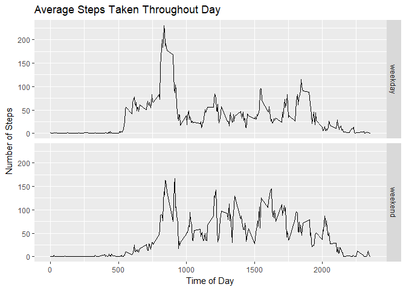

```r
suppressWarnings(library(tidyverse))
```

```
## -- Attaching packages ----------------------- tidyverse 1.2.1 --
```

```
## v ggplot2 2.2.1     v purrr   0.2.4
## v tibble  1.4.1     v dplyr   0.7.4
## v tidyr   0.7.2     v stringr 1.2.0
## v readr   1.1.1     v forcats 0.2.0
```

```
## -- Conflicts -------------------------- tidyverse_conflicts() --
## x dplyr::filter() masks stats::filter()
## x dplyr::lag()    masks stats::lag()
```

```r
data <- read_csv("activity.csv")
```

```
## Parsed with column specification:
## cols(
##   steps = col_integer(),
##   date = col_date(format = ""),
##   interval = col_integer()
## )
```
## What is the mean total number of steps taken per day?


```r
#1 Mean steps taken daily
tot_steps <- data %>% group_by(date) %>% summarise(Total = sum(steps, na.rm = TRUE))
hist(tot_steps$Total, breaks = 15, 
     main = "Total Number of Steps Each Day ",
     xlab = "Total steps (ignore missing)",
     col = "blue")
```

<!-- -->

### Mean and median number of total steps taken per day


```r
summary(tot_steps$Total)
```

```
##    Min. 1st Qu.  Median    Mean 3rd Qu.    Max. 
##       0    6778   10400    9354   12810   21190
```
- Mean: 9,354 steps
- Median: 10,400 steps
 
## What is the average daily activity pattern?
 

```r
# make a copy of the data set
pattern <- data %>% group_by(interval) %>% summarise(Activity = mean(steps, na.rm = TRUE))

plot(Activity ~ interval, pattern, type = "l",
     main = "Average Daily Activity Pattern",
     xlab = "Time of Day",
     ylab = "Steps Taken")  
```

<!-- -->

### Which 5-minute interval, on average across all the days in the dataset, contains the maximum number of steps?


```r
pattern[which(pattern$Activity == max(pattern$Activity)), 1]
```

```
## # A tibble: 1 x 1
##   interval
##      <int>
## 1      835
```

### The maximum average number of steps across all days occurs at 8:35 a.m.

## Impute missing values
### How many values in the data set are missing?


```r
# Calculate and report the total numer of missing values in the dataset

mean(is.na(data$steps))
```

```
## [1] 0.1311475
```

```r
sum(is.na(data$steps))
```

```
## [1] 2304
```

### There are 2,304 missing data values out of 17,568 total observations (13.1% missing)

### Replace missing values with the mean number of steps for that 5-minute interval and recompute total steps

```r
full_data <- data
missing <- is.na(full_data$steps)
      for (i in 1:length(missing)) {
            if (missing[i]) {
                  full_data$steps[i] = pattern$Activity[which(pattern$interval == full_data$interval[i])]
            }
      }
full_steps <- full_data %>% group_by(date) %>% summarise(Total = sum(steps, na.rm = TRUE))
hist(full_steps$Total, breaks = 15, 
     main = "Total Number of Steps Each Day ",
     xlab = "Total steps (impute missing)",
     col = "green")
```

<!-- -->

```r
summary(full_steps$Total)
```

```
##    Min. 1st Qu.  Median    Mean 3rd Qu.    Max. 
##      41    9819   10770   10770   12810   21190
```

### With imputed data, mean increased from 9,354 steps to 10,770 steps and median increased from 10,400 steps to 10,770 steps. Imputing the data causes both mean and median to increase since all missing values are replaced by positive values for mean number of steps.


## Are there differences in activity patterns between weekdays and weekends?


```r
weekday_data <- full_data
# create factor variable from date that contains day of week
weekday_data$type <- as.factor(weekdays(weekday_data$date))
# collapse and rename factor levels to "weekend" or "weekday"
levels(weekday_data$type) <- list(weekday= c("Monday", "Tuesday", "Wednesday","Thursday", "Friday"),weekend = c("Saturday", "Sunday"))

week_pattern <- weekday_data %>% group_by(type, interval) %>% 
                        summarise(Activity = mean(steps, na.rm = TRUE))

ggplot(week_pattern, aes(x = interval, y = Activity), title = "Average Steps Taken") + 
      geom_line() + facet_grid(type ~ .) + 
      ggtitle("Average Steps Taken Throughout Day") + 
      labs(x = "Time of Day", y = "Number of Steps")
```

<!-- -->

### The number of steps taken throughout the day is generally higher on the weekends and activity also generally both starts later in the day and ends later in the day on the weekends.


